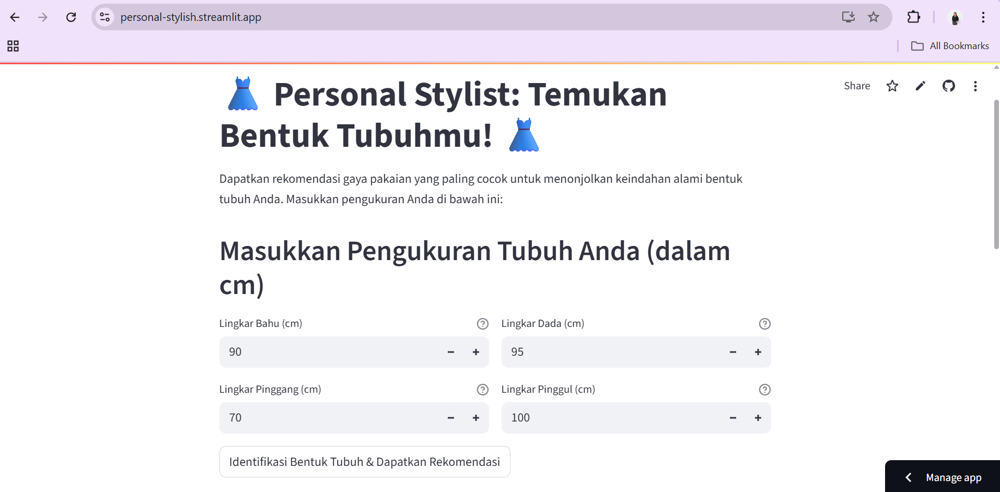
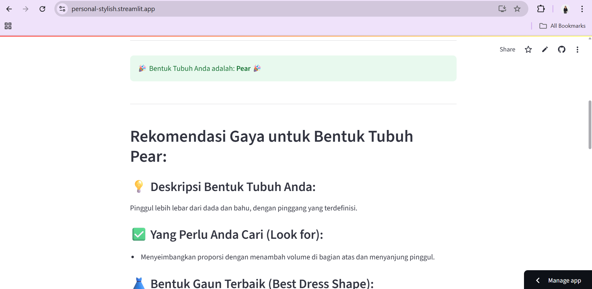
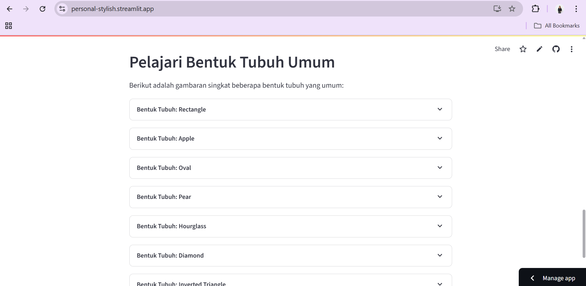

Personal Stylist: Temukan Gaya Terbaikmu! 👗

📝 Deskripsi Singkat
Proyek ini adalah sebuah aplikasi Personal Stylist interaktif berbasis web yang dibangun menggunakan Streamlit. Tujuannya adalah untuk membantu pengguna mengidentifikasi bentuk tubuh mereka berdasarkan ukuran lingkar bahu, dada, pinggang, dan pinggul, kemudian memberikan rekomendasi gaya pakaian yang dipersonalisasi. Latar belakang masalahnya adalah kesulitan banyak orang dalam memilih pakaian yang menyanjung bentuk tubuh mereka, seringkali berujung pada rasa tidak percaya diri atau pembelian pakaian yang kurang optimal. Aplikasi ini bertujuan untuk menyederhanakan proses tersebut dengan menyediakan panduan gaya yang jelas dan mudah diakses, memberdayakan pengguna untuk berbusana dengan lebih percaya diri dan sesuai dengan siluet alami mereka.

✨ Fitur-Fitur Utama
Input Pengukuran Tubuh: Pengguna dapat memasukkan ukuran lingkar bahu, dada, pinggang, dan pinggul mereka dalam sentimeter.

Identifikasi Bentuk Tubuh: Algoritma cerdas (berbasis rasio pengukuran) akan mengidentifikasi bentuk tubuh pengguna (misalnya, Hourglass, Rectangle, Pear, Apple, Oval, Diamond, dan Inverted Triangle).

Rekomendasi Gaya Personalisasi: Berdasarkan bentuk tubuh yang teridentifikasi, aplikasi akan menampilkan rekomendasi detail mengenai:
- Deskripsi bentuk tubuh.
- Hal-hal yang perlu dicari dalam pakaian (potongan, siluet).
- Bentuk gaun terbaik.
- Petunjuk gaya umum.
- Hal-hal yang sebaiknya dihindari.

Edukasi Bentuk Tubuh: Bagian terpisah untuk mempelajari lebih lanjut tentang karakteristik dan rekomendasi gaya untuk setiap bentuk tubuh yang umum.

Penggunaan OOP: Struktur kode menggunakan Object-Oriented Programming (OOP) dengan kelas BodyShape untuk manajemen data yang terorganisir.

Penggunaan Data Structures: Pemanfaatan Dictionary untuk menyimpan objek BodyShape dan List untuk rekomendasi gaya (e.g., look_for, hint, avoid).

Penggunaan Looping: Implementasi looping untuk menampilkan rekomendasi dan mengiterasi informasi bentuk tubuh.

Penggunaan Library Eksternal: Pemanfaatan library pandas untuk memuat data rekomendasi dari file CSV, menjamin fleksibilitas dan pemisahan data dari kode.

🚀 Cara Menjalankan di Lokal
Untuk menjalankan aplikasi ini di komputer lokal Anda, ikuti langkah-langkah berikut:

Kloning Repositori:
Buka terminal atau command prompt Anda dan kloning repositori ini:

Bash

git clone https://github.com/rarazhafira3/final_project_REA6NSAKZ.git
cd final_project_REA6NSAKZ

Buat Virtual Environment (Direkomendasikan):

Bash

python -m venv venv
# Di Windows:
.\venv\Scripts\activate
# Di macOS/Linux:
source venv/bin/activate
Instal Dependensi:
Pastikan Anda memiliki file requirements.txt di root folder proyek. Kemudian instal dependensinya:

Bash

pip install -r requirements.txt

Isi requirements.txt seharusnya:

streamlit
pandas

Siapkan Data:
Pastikan Anda memiliki folder data/ di root proyek Anda, dan di dalamnya terdapat file body_shape_recommendations.csv. Anda dapat membuat file ini secara manual atau mengunduhnya jika sudah tersedia di repositori.

Jalankan Aplikasi Streamlit:
Setelah semua dependensi terinstal, jalankan aplikasi:

Bash

streamlit run app.py
Aplikasi akan terbuka secara otomatis di browser web default Anda.

📸 Preview Aplikasi
Berikut adalah beberapa tangkapan layar dari aplikasi yang sedang berjalan:

🔗 Link Deploy Aplikasi
Aplikasi ini telah dideploy ke platform cloud dan dapat diakses melalui link berikut:

Streamlit Cloud: [(https://personal-stylish.streamlit.app/)]